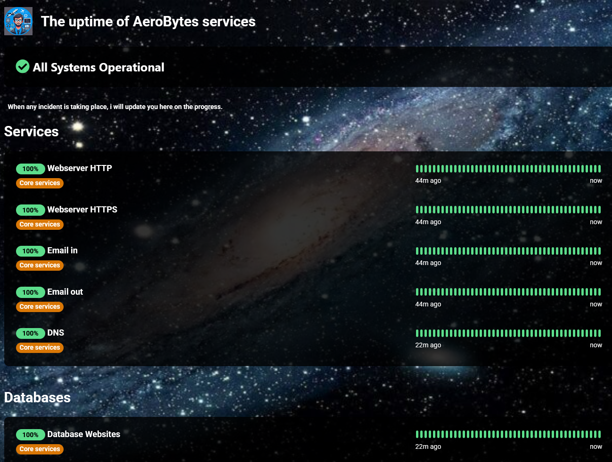
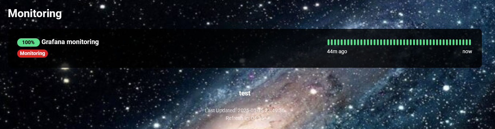

# Kumari 
An Uptime Kuma status page theme.

## Description
Created with CSS, to improve the looks of you're status page!

## Features
* CSS variables to configure it to your needs.
* Clear comments so you can modify it yourself!

## Screenshots
Main:

Footer:

## Getting Started

### Installation
1) Copy the content from `custom.css`.
2) Go to your Uptime Kuma status page (you need to be signed in).
3) Click on `Edit Status Page`.
4) Paste the content inside the `Custom CSS` input field.

### Configuration
1) You can modify the values inside `:root {}` to fit your needs. 
2) Alternatively you can modify the CSS itself. It's nicely commented.

## Help
If you encounter any problems or need advise how to customize if further, feel free to 
create an issue in this repo.

## Authors
1) [AeroBytes](https://aerobytes.nl)

## License

This project is licensed under the GNU GENERAL PUBLIC LICENSE Version 3 License.  
See the LICENSE.md file for details.
